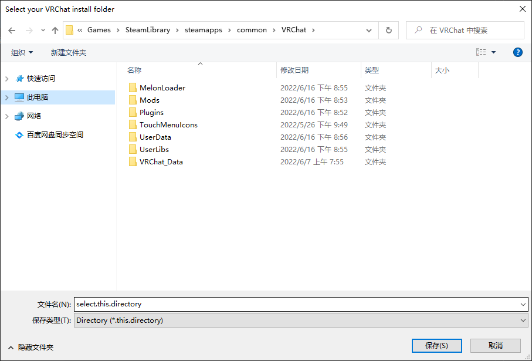
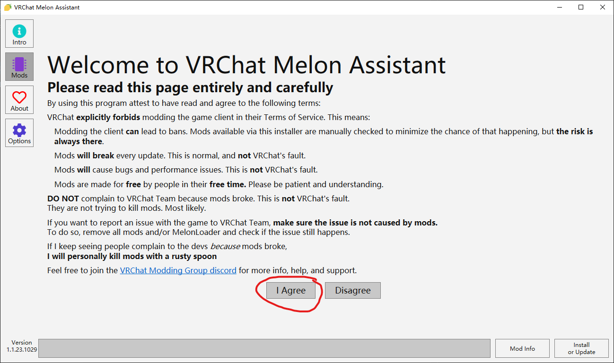
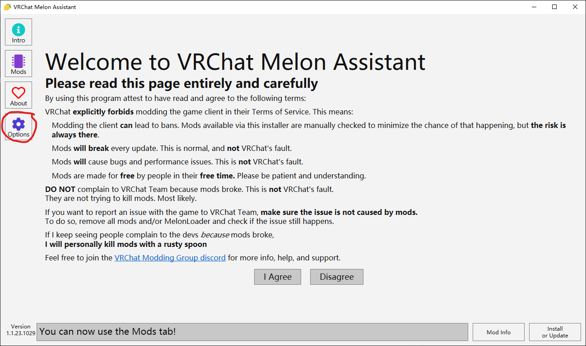
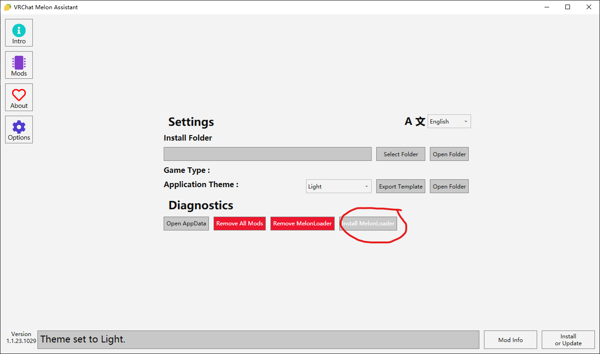
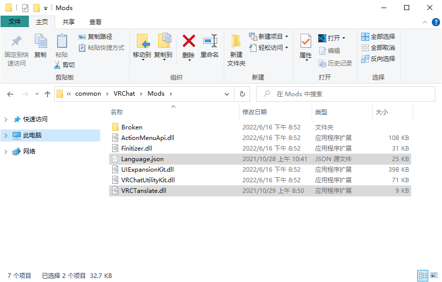
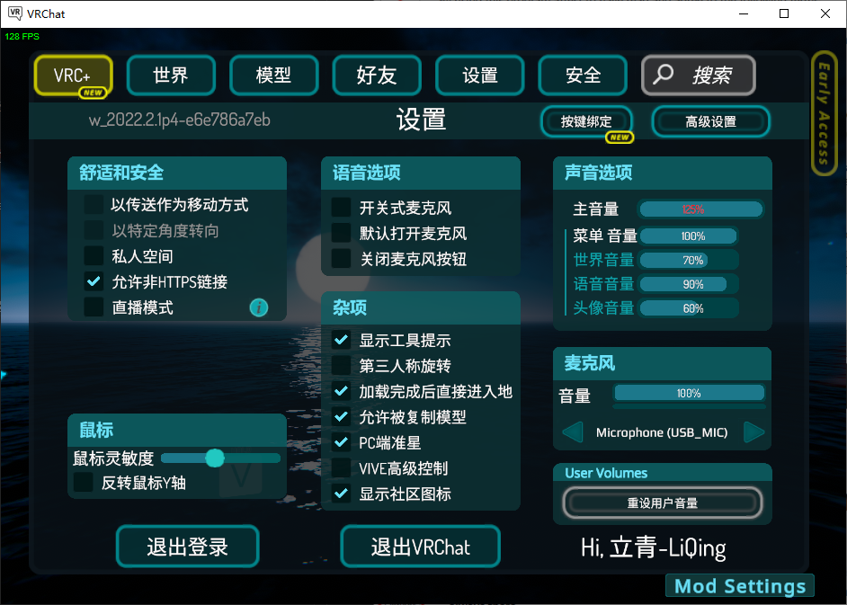

# VRChat 汉化教程

## 汉化工具文件

地址:https://wws.lanzout.com/b011qhkzg
密码:vrchat

[VRCMelonAssistant]:https://github.com/knah/VRCMelonAssistant
[MelonLoader]:https://github.com/LavaGang/MelonLoader

## 1. 安装 [VRCMelonAssistant] 和 [MelonLoader]

开源代码库 
- [VRCMelonAssistant]
- [MelonLoader]

打开 "VRCMelonAssistant.exe" ，如果出现下面的提示

就需要手动选择VRChat游戏目录了

选择好目录以后点击保存，接着就会显示主界面

点击 "I Agree" ，现在Mods按钮已经解锁，可以在里面下载安装Mod

现在需要安装[MelonLoader]，点击 "Options" 

点击 "Install MelonLoader"
现在已经成功安装了 [VRCMelonAssistant] 和 [MelonLoader]

## 2. 安装 VRChat多语言插件
开源代码库 [VRChat多语言插件(Melon版)](https://github.com/XLjiangA/VRChat-ModuleLoader-Csharp)

下载并解压 "VRCTrans.zip" 到 VRChat游戏目录下的Mods文件夹就可以完成安装

下面选中的文件是多语言插件的文件

现在打开游戏展开菜单就能看到汉化效果，快捷菜单貌似没效果

